 

  

 

## ⟡ About Me

### Nahla Nabil — AI Engineer & Machine Learning Researcher
📍 Muharraq, Kingdom of Bahrain
🎓 B.Sc. Artificial Intelligence — Arab Open University Bahrain *(dual-awarded with The Open University, UK)* · First Class Honors · Bahrain's first-ever undergraduate AI cohort
📝 2 × IEEE publications — ML auditing & interpretability

 

 

## ⟡ Tech Stack

 

## ⟡ Contribution Snake

A snake that lives on my contribution graph and eats through it every day 🐍

<picture>
  <source media="(prefers-color-scheme: dark)" srcset="https://raw.githubusercontent.com/Nahla-Nabil/Nahla-Nabil/output/github-contribution-grid-snake-dark.svg" />
  <source media="(prefers-color-scheme: light)" srcset="https://raw.githubusercontent.com/Nahla-Nabil/Nahla-Nabil/output/github-contribution-grid-snake.svg" />
  
</picture>

 

## ⟡ GitHub Stats

  

 

## ⟡ Let's Connect

I'm always up for collaborating on AI safety research, LLM systems, applied ML with real-world impact, or a good hackathon.
Feel free to reach out — I love talking about research, ideas, and turning "what if" into a working prototype.

  

